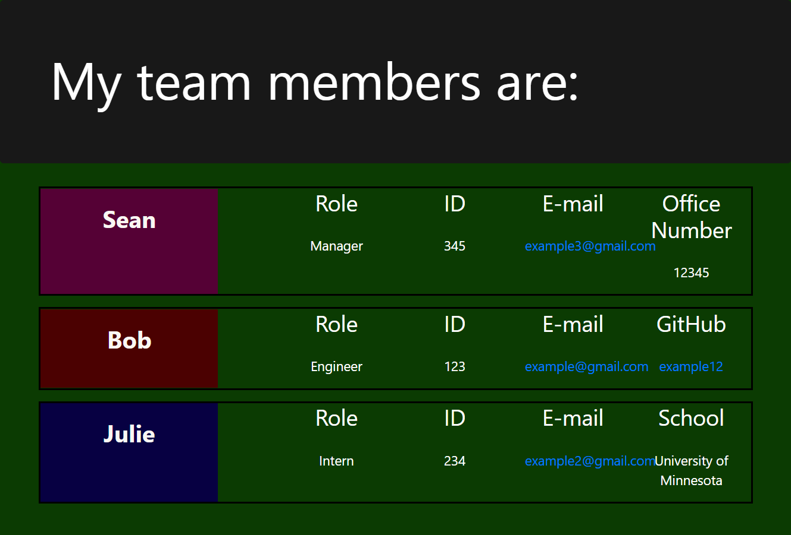

# Team Profile Generator

## Table of Contents
- [Walkthrough](#Walkthrough)
- [Description](#description)
- [Installation](#installation)
- [Usage](#usage)
- [Credits](#credits)
- [License](#license)
- [Contributing](#contributing)
- [Test](#tests)

## Walkthrough

User Prompts on Node Walkthrough:
  - https://drive.google.com/file/d/1C8RTVAouPfyINE95T8_8D9zIIrhguX2D/view?usp=sharing

Test Walkthrough:
  - https://drive.google.com/file/d/1A2E-8ML3TSov90HUoiPtBGRGoTSdgfNG/view?usp=sharing

## Description

This application allows the user to input team members and list their name, email, id number, job role, github username, office number, and school. After all of the team members have been entered an HTML page is created listing all of the team members and organizes them by their job role. 

## Installation

First download the files from my github. Next you will need to open terminal in VS code and run "npm init y." After this is completed run "npm i jest" and "npm i inquirer." When those are finished installing you will need to get to the "develop folder" bu useing "cd develop." In the terminal on VS code type "node app." The prompts will then run and you can enter in your team members. When you are done you can open the HTML page under the "output" folder. 

## Usage

Once you have followed the installation instructions you should be able to open the user prompt questions by entering "node app" in the terminal. 
The first screenshot is an example of a rendered HTML page using this application. The second screenshot is what the terminal will look like when you enter in the information about your team members.  

  

  

## Credits

- Technologies used:
    - Bootstrap
    - Node.js
    - NPM
    - Inquirer Node Module
    - Jest Node Module
    - Javascript

- I recieved assistance from my tutor Anthony Stematz-Breitling. He helped with the tests and rendering the prompts to the HTML page. 

## License

MIT License

Copyright (c) [2021] [Chris Beard]

Permission is hereby granted, free of charge, to any person obtaining a copy of this software and associated documentation files (the "Software"), to deal in the Software without restriction, including without limitation the rights to use, copy, modify, merge, publish, distribute, sublicense, and/or sell copies of the Software, and to permit persons to whom the Software is furnished to do so, subject to the following conditions:

The above copyright notice and this permission notice shall be included in all copies or substantial portions of the Software.

THE SOFTWARE IS PROVIDED "AS IS", WITHOUT WARRANTY OF ANY KIND, EXPRESS OR IMPLIED, INCLUDING BUT NOT LIMITED TO THE WARRANTIES OF MERCHANTABILITY, FITNESS FOR A PARTICULAR PURPOSE AND NONINFRINGEMENT. IN NO EVENT SHALL THE AUTHORS OR COPYRIGHT HOLDERS BE LIABLE FOR ANY CLAIM, DAMAGES OR OTHER LIABILITY, WHETHER IN AN ACTION OF CONTRACT, TORT OR OTHERWISE, ARISING FROM, OUT OF OR IN CONNECTION WITH THE SOFTWARE OR THE USE OR OTHER DEALINGS IN THE SOFTWARE.

## Contributing

- Please message me on GitHub with any contributions you think might improve this application. 

## Tests

- 4 test suites were passed with a total of 17 test. 
